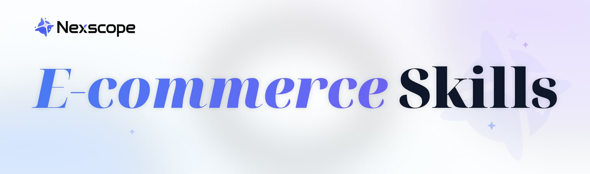

<div align="center">

# E-commerce Skills by Nexscope

**109 ready-to-use AI agent skills for ecommerce research, marketplace intelligence, product discovery, keyword analysis, trend research, sourcing, patent and trademark screening, multimodal tasks, and GEO workflows.**

For Amazon, TikTok Shop, Ozon, 1688, Shopify, Temu, Walmart, Shopee, Etsy, eBay, and more.

</div>

---

## Quick Start

### 1. Clone the collection

```bash
git clone https://github.com/nexscope-ai/nexscope-ecommerce-skills.git
cd nexscope-ecommerce-skills
```

### 2. Install the skills you need

Each top-level `ecommerce.*` directory is an individual skill package. Copy the complete directory into the skills location used by your AI agent. Keep its `SKILL.md`, scripts, references, assets, and manifest files together.

Example:

```bash
cp -R ecommerce.amazon-search <your-agent-skills-directory>/
```

You can also install the whole collection if your agent supports loading multiple skill directories from one repository. See the [external skills setup guide](https://www.nexscope.ai/help/skills-external-access?co-from=githubNS) for agent-specific instructions.

### 3. Configure API access

Most API-backed skills require these environment variables:

```bash
export NEXSCOPE_PROXY_BASE=https://api.nexscope.ai/
export NEXSCOPE_API_KEY=<your_api_key>
```

Get or manage an API key on the [Nexscope API Keys page](https://www.nexscope.ai/seller/api-access?co-from=githubNS). API calls may consume credits; check the selected skill's `SKILL.md` before running additional queries or retries.

### 4. Ask naturally

Examples:

> "Search Amazon US for wireless earbuds and show the current organic and sponsored results."

> "Find TikTok Shop beauty products with strong 30-day sales and at least a 10% commission rate."

> "Show Ozon products for this seller and summarize their pricing and sales metrics."

> "Search 1688 for visually similar suppliers using this product image."

> "Check this product image for similar design patents."

> "Score this product page for SEO and GEO readiness."

> "Evaluate whether AI search engines mention and recommend this product."

---

## Collection at a Glance

| Category | Skills |
|---|---:|
| Amazon Intelligence | 38 |
| TikTok Shop Intelligence | 15 |
| Ozon Intelligence | 13 |
| Patent, Trademark & Compliance | 18 |
| 1688 Sourcing | 3 |
| Other Marketplaces & Storefronts | 11 |
| Web, Trends, Multimodal & GEO | 11 |
| **Total** | **109** |

---

## All 109 Skills

### Amazon Intelligence (38)

| Skill | What it does |
|---|---|
| [`amazon-ads-api-access`](./ecommerce.amazon-ads-api-access/) | Authorize Amazon Ads accounts and inspect connection and profile metadata. |
| [`amazon-ads-reporting-api`](./ecommerce.amazon-ads-reporting-api/) | Create, poll, resume, download, and save Amazon Ads v3 reports. |
| [`amazon-advertising-api`](./ecommerce.amazon-advertising-api/) | Authorize Amazon Ads accounts, manage SP, SB, and SD entities, and retrieve reports. |
| [`amazon-alexa-search`](./ecommerce.amazon-alexa-search/) | Search Amazon Alexa shopping results. |
| [`amazon-asin-keywords`](./ecommerce.amazon-asin-keywords/) | Retrieve keywords associated with an Amazon ASIN. |
| [`amazon-asin-traffic-summary`](./ecommerce.amazon-asin-traffic-summary/) | Retrieve an Amazon ASIN traffic summary. |
| [`amazon-broad-product-search`](./ecommerce.amazon-broad-product-search/) | Search broadly for Amazon products. |
| [`amazon-competitor-lookup`](./ecommerce.amazon-competitor-lookup/) | Look up competing Amazon products. |
| [`amazon-keyword-expansion`](./ecommerce.amazon-keyword-expansion/) | Expand an Amazon keyword. |
| [`amazon-keyword-intelligence`](./ecommerce.amazon-keyword-intelligence/) | Query Amazon keyword intelligence data. |
| [`amazon-keyword-overview`](./ecommerce.amazon-keyword-overview/) | Retrieve an overview for an Amazon keyword. |
| [`amazon-keyword-search-history`](./ecommerce.amazon-keyword-search-history/) | Retrieve historical Amazon keyword search volume. |
| [`amazon-keyword-share-of-voice`](./ecommerce.amazon-keyword-share-of-voice/) | Retrieve Amazon keyword share of voice. |
| [`amazon-keyword-summary`](./ecommerce.amazon-keyword-summary/) | Retrieve a summary for an Amazon keyword. |
| [`amazon-market-product-detail`](./ecommerce.amazon-market-product-detail/) | Retrieve Amazon marketplace product details. |
| [`amazon-market-product-search`](./ecommerce.amazon-market-product-search/) | Search for products in the Amazon marketplace. |
| [`amazon-market-research`](./ecommerce.amazon-market-research/) | Research an Amazon market. |
| [`amazon-market-statistics`](./ecommerce.amazon-market-statistics/) | Analyze Amazon market statistics. |
| [`amazon-niche-info`](./ecommerce.amazon-niche-info/) | Retrieve Amazon niche information. |
| [`amazon-niche-info-by-asin`](./ecommerce.amazon-niche-info-by-asin/) | Retrieve Amazon niche information by ASIN. |
| [`amazon-niche-info-by-keyword`](./ecommerce.amazon-niche-info-by-keyword/) | Retrieve Amazon niche information by keyword. |
| [`amazon-niche-reviews-by-keyword`](./ecommerce.amazon-niche-reviews-by-keyword/) | Retrieve Amazon niche reviews by keyword. |
| [`amazon-opportunity-report-by-keyword`](./ecommerce.amazon-opportunity-report-by-keyword/) | Retrieve Amazon opportunity reports by keyword. |
| [`amazon-opportunity-search-by-metrics`](./ecommerce.amazon-opportunity-search-by-metrics/) | Search Amazon opportunities by metrics. |
| [`amazon-policy-feed`](./ecommerce.amazon-policy-feed/) | Retrieve marketplace policy updates and full article details. |
| [`amazon-product-database`](./ecommerce.amazon-product-database/) | Query the Amazon product database. |
| [`amazon-product-database-search`](./ecommerce.amazon-product-database-search/) | Search the Amazon product database. |
| [`amazon-product-detail`](./ecommerce.amazon-product-detail/) | Retrieve Amazon product details. |
| [`amazon-product-discovery`](./ecommerce.amazon-product-discovery/) | Discover Amazon products. |
| [`amazon-product-history`](./ecommerce.amazon-product-history/) | Retrieve Amazon product history and product details. |
| [`amazon-product-price-series`](./ecommerce.amazon-product-price-series/) | Retrieve Amazon product price and metric series. |
| [`amazon-product-research-api`](./ecommerce.amazon-product-research-api/) | Route Amazon product research across market, keyword, competitor, trend, review, and profitability capabilities. |
| [`amazon-related-asins`](./ecommerce.amazon-related-asins/) | Retrieve Amazon ASINs related to an ASIN. |
| [`amazon-reviews-list`](./ecommerce.amazon-reviews-list/) | Retrieve Amazon product reviews. |
| [`amazon-sales-estimates`](./ecommerce.amazon-sales-estimates/) | Estimate historical daily sales for an Amazon product. |
| [`amazon-search`](./ecommerce.amazon-search/) | Search Amazon products. |
| [`amazon-search-by-image`](./ecommerce.amazon-search-by-image/) | Search for visually similar products on Amazon using an image across eight marketplaces. |
| [`amazon-traffic-keywords`](./ecommerce.amazon-traffic-keywords/) | Research Amazon traffic keywords. |

### TikTok Shop Intelligence (15)

| Skill | What it does |
|---|---|
| [`tiktok-batch-product-detail`](./ecommerce.tiktok-batch-product-detail/) | Retrieve batch TikTok product details. |
| [`tiktok-creator-analytics`](./ecommerce.tiktok-creator-analytics/) | Retrieve TikTok creator rankings and creator-level analytics. |
| [`tiktok-creator-search-api`](./ecommerce.tiktok-creator-search-api/) | Search TikTok ecommerce creator rankings by market and date range. |
| [`tiktok-livestream-analytics`](./ecommerce.tiktok-livestream-analytics/) | Retrieve TikTok livestream rankings and livestream details. |
| [`tiktok-new-product-rank`](./ecommerce.tiktok-new-product-rank/) | Retrieve TikTok new-product rankings. |
| [`tiktok-product-analytics`](./ecommerce.tiktok-product-analytics/) | Retrieve TikTok product rankings and product details. |
| [`tiktok-product-analytics-api`](./ecommerce.tiktok-product-analytics-api/) | Retrieve price, sales, revenue, commission, lifecycle, and shop data for a TikTok product. |
| [`tiktok-product-discovery`](./ecommerce.tiktok-product-discovery/) | Discover TikTok products. |
| [`tiktok-product-search`](./ecommerce.tiktok-product-search/) | Search TikTok products. |
| [`tiktok-seller-detail`](./ecommerce.tiktok-seller-detail/) | Get detailed metrics and attributes for one TikTok Shop seller. |
| [`tiktok-shop-analytics`](./ecommerce.tiktok-shop-analytics/) | Retrieve TikTok shop rankings and shop details. |
| [`tiktok-top-selling-products`](./ecommerce.tiktok-top-selling-products/) | Retrieve TikTok Shop top-selling product rankings. |
| [`tiktok-video-analytics`](./ecommerce.tiktok-video-analytics/) | Retrieve TikTok video rankings and video details. |
| [`tiktok-video-download-url`](./ecommerce.tiktok-video-download-url/) | Retrieve a TikTok video download URL. |
| [`tiktok-video-search`](./ecommerce.tiktok-video-search/) | Search TikTok videos by market, creator, product, engagement, and publication filters. |

### Ozon Intelligence (13)

| Skill | What it does |
|---|---|
| [`ozon-brand-products`](./ecommerce.ozon-brand-products/) | Retrieve Ozon products for a brand. |
| [`ozon-category-products`](./ecommerce.ozon-category-products/) | Retrieve Ozon products for a category. |
| [`ozon-category-search`](./ecommerce.ozon-category-search/) | Search Ozon category products. |
| [`ozon-keyword-back-search`](./ecommerce.ozon-keyword-back-search/) | Find Ozon keywords associated with product SKUs. |
| [`ozon-keyword-mining`](./ecommerce.ozon-keyword-mining/) | Mine related Ozon search keywords. |
| [`ozon-market-keyword-search`](./ecommerce.ozon-market-keyword-search/) | Search Ozon marketplace keyword metrics. |
| [`ozon-product-detail`](./ecommerce.ozon-product-detail/) | Retrieve batch Ozon product details. |
| [`ozon-product-detail-search`](./ecommerce.ozon-product-detail-search/) | Retrieve Ozon product detail history. |
| [`ozon-product-report-search`](./ecommerce.ozon-product-report-search/) | Search Ozon product reports. |
| [`ozon-product-search`](./ecommerce.ozon-product-search/) | Search Ozon products by keyword or product ID. |
| [`ozon-product-trend`](./ecommerce.ozon-product-trend/) | Retrieve daily Ozon product trends. |
| [`ozon-seller-products`](./ecommerce.ozon-seller-products/) | Retrieve Ozon products for a seller. |
| [`ozon-shop-search`](./ecommerce.ozon-shop-search/) | Search Ozon shops and seller metrics. |

### Patent, Trademark & Compliance (18)

| Skill | What it does |
|---|---|
| [`patent-abstract-image-data`](./ecommerce.patent-abstract-image-data/) | Retrieve patent abstract image data. |
| [`patent-claims`](./ecommerce.patent-claims/) | Retrieve original patent claims and claim counts. |
| [`patent-claims-translation`](./ecommerce.patent-claims-translation/) | Retrieve translated patent claims. |
| [`patent-description-data`](./ecommerce.patent-description-data/) | Retrieve original patent description data. |
| [`patent-description-data-translation`](./ecommerce.patent-description-data-translation/) | Retrieve translated patent description data. |
| [`patent-detailed-bibliography`](./ecommerce.patent-detailed-bibliography/) | Retrieve detailed patent bibliography data. |
| [`patent-fulltext-images`](./ecommerce.patent-fulltext-images/) | Retrieve patent full-text image data. |
| [`patent-legal-status-data`](./ecommerce.patent-legal-status-data/) | Retrieve patent legal status data. |
| [`patent-search-api`](./ecommerce.patent-search-api/) | Search patents with Analytics query expressions and return matching patent identifiers and publication numbers. |
| [`patent-title-abstract-translation`](./ecommerce.patent-title-abstract-translation/) | Retrieve translated patent titles and abstracts. |
| [`ruiguan-copyright-detection`](./ecommerce.ruiguan-copyright-detection/) | Detect image copyright infringement risks by comparing against a database of registered copyrighted works. |
| [`ruiguan-detection-patent-design`](./ecommerce.ruiguan-detection-patent-design/) | Detect design patent infringement risks by comparing a product image against a global design patent database across more than 25 jurisdictions. |
| [`ruiguan-gun-parts-search`](./ecommerce.ruiguan-gun-parts-search/) | Check product images against a database of policy-violating items using visual similarity. |
| [`ruiguan-trademark-graphic-detection`](./ecommerce.ruiguan-trademark-graphic-detection/) | Detect graphic trademarks in product images by comparing against registered trademark databases across multiple regions. |
| [`text-trademark-detector`](./ecommerce.text-trademark-detector/) | Detect trademark risks in product titles and text. |
| [`utility-patent-detector`](./ecommerce.utility-patent-detector/) | Check products for utility patent similarity. |
| [`zhihuiya-patent-image-search`](./ecommerce.zhihuiya-patent-image-search/) | Search for visually similar design patents using an image, with country, legal status, and date filters. |
| [`zhihuiya-utility-patent-image-search`](./ecommerce.zhihuiya-utility-patent-image-search/) | Search for visually similar utility model patents using an image, with country, legal status, and date filters. |

These skills support research and screening workflows. Their results are not legal advice and do not replace review by a qualified intellectual property professional.

### 1688 Sourcing (3)

| Skill | What it does |
|---|---|
| [`1688-product-billboard`](./ecommerce.1688-product-billboard/) | Retrieve 1688 bestseller ranking data. |
| [`1688-product-search`](./ecommerce.1688-product-search/) | Search 1688 products with sourcing and sales filters. |
| [`1688-search-by-image`](./ecommerce.1688-search-by-image/) | Search for visually similar products on 1688 using an image. |

### Other Marketplaces & Storefronts (11)

| Skill | What it does |
|---|---|
| [`ebay-search`](./ecommerce.ebay-search/) | Search eBay products. |
| [`etsy-category-search`](./ecommerce.etsy-category-search/) | Search Etsy marketplace categories. |
| [`etsy-product-query`](./ecommerce.etsy-product-query/) | Query Etsy product listings and performance data. |
| [`shopee-product-search`](./ecommerce.shopee-product-search/) | Search Shopee product information and metrics. |
| [`shopify-product-query`](./ecommerce.shopify-product-query/) | Query Shopify products with filters. |
| [`shopify-store-query`](./ecommerce.shopify-store-query/) | Query Shopify stores with filters. |
| [`temu-category-search`](./ecommerce.temu-category-search/) | Search Temu categories. |
| [`temu-product-source-query`](./ecommerce.temu-product-source-query/) | Query Temu products for sourcing research. |
| [`temu-store-source-query`](./ecommerce.temu-store-source-query/) | Query Temu stores for sourcing research. |
| [`walmart-product-detail`](./ecommerce.walmart-product-detail/) | Retrieve Walmart product details. |
| [`walmart-search`](./ecommerce.walmart-search/) | Search Walmart products. |

### Web, Trends, Multimodal & GEO (11)

| Skill | What it does |
|---|---|
| [`geo-score-check`](./ecommerce.geo-score-check/) | Score an ecommerce URL for SEO and GEO readiness from crawlable evidence. |
| [`google-ai-mode-search`](./ecommerce.google-ai-mode-search/) | Search Google AI Mode results. |
| [`google-trends-by-keywords`](./ecommerce.google-trends-by-keywords/) | Retrieve Google Trends data for keywords. |
| [`google-trends-by-time`](./ecommerce.google-trends-by-time/) | Retrieve Google Trends data by time range. |
| [`multimodal-generate-image`](./ecommerce.multimodal-generate-image/) | Generate and edit images from text prompts and optional reference images. |
| [`multimodal-recognize-image`](./ecommerce.multimodal-recognize-image/) | Analyze images and extract information with multimodal AI recognition. |
| [`product-ai-visibility`](./ecommerce.product-ai-visibility/) | Evaluate product mentions and recommendation positions across AI search engines. |
| [`product-description-generator-api`](./ecommerce.product-description-generator-api/) | Generate ecommerce descriptions and other text asynchronously, and retrieve task results. |
| [`product-video-generator-api`](./ecommerce.product-video-generator-api/) | Generate product videos asynchronously from one image or controlled first and last frames. |
| [`reverse-product-image-search-api`](./ecommerce.reverse-product-image-search-api/) | Find visual or keyword-derived competitors from a product image or URL. |
| [`web-search`](./ecommerce.web-search/) | Search the web for a keyword. |

---

## How Each Skill Works

Start with the selected directory's `SKILL.md`. It defines:

- when the skill should trigger;
- required and optional inputs;
- supported marketplaces, filters, and limits;
- the API endpoint or local workflow;
- safe handling for credits, retries, missing data, and errors;
- the expected output format.

Most API-backed packages also include:

```text
ecommerce.example-skill/
├── SKILL.md
├── manifest.json
├── references/
│   └── api.md
└── scripts/
    └── example_skill.py
```

Do not copy only `SKILL.md` when a package contains scripts, references, assets, configuration, or manifest files.

---

## Usage Notes

- **Evidence first:** Results depend on the data returned for the exact marketplace, keyword, product, seller, date range, and filters used.
- **No automatic extra spend:** Many API-backed skills instruct the agent not to retry with changed parameters or fetch additional pages without approval.
- **Marketplace differences:** Supported countries, domains, languages, currencies, and available fields vary by skill.
- **Image workflows:** Image-search and image-analysis skills may require an accessible image URL or the included upload helper.
- **Readiness is not visibility:** `ecommerce.geo-score-check` evaluates crawlable SEO/GEO readiness. It does not measure live AI mentions.
- **Time-bound AI results:** `ecommerce.product-ai-visibility` evaluates current AI responses; results can change as models and source content change.

---

## Troubleshooting

### Missing credentials

```text
NEXSCOPE_PROXY_BASE and NEXSCOPE_API_KEY are required
```

Set both environment variables in the same shell or runtime that launches the skill.

### Authentication or credit errors

Confirm that the API key is valid and that the account has enough credits for the requested call. Manage access on the [Nexscope API Keys page](https://www.nexscope.ai/seller/api-access?co-from=githubNS).

### Skill not detected

- Copy the complete `ecommerce.*` directory into the correct skills location.
- Keep the folder name unchanged.
- Restart or reload the agent if it discovers skills only at startup.
- Read the agent-specific [setup guide](https://www.nexscope.ai/help/skills-external-access?co-from=githubNS).

### Request or response details

Read the selected skill's `references/api.md` and script usage section. Parameters and supported marketplaces differ between skills.

---

## License

These skills are proprietary software owned by Nexscope. API-backed usage requires valid Nexscope access and may consume credits.

© 2026 Nexscope AI

---

Built by **[Nexscope](https://www.nexscope.ai/?co-from=githubNS)** — an all-in-one AI agent for ecommerce sellers, helping them research products, uncover keywords and review insights, improve GEO visibility, and scale their businesses.
